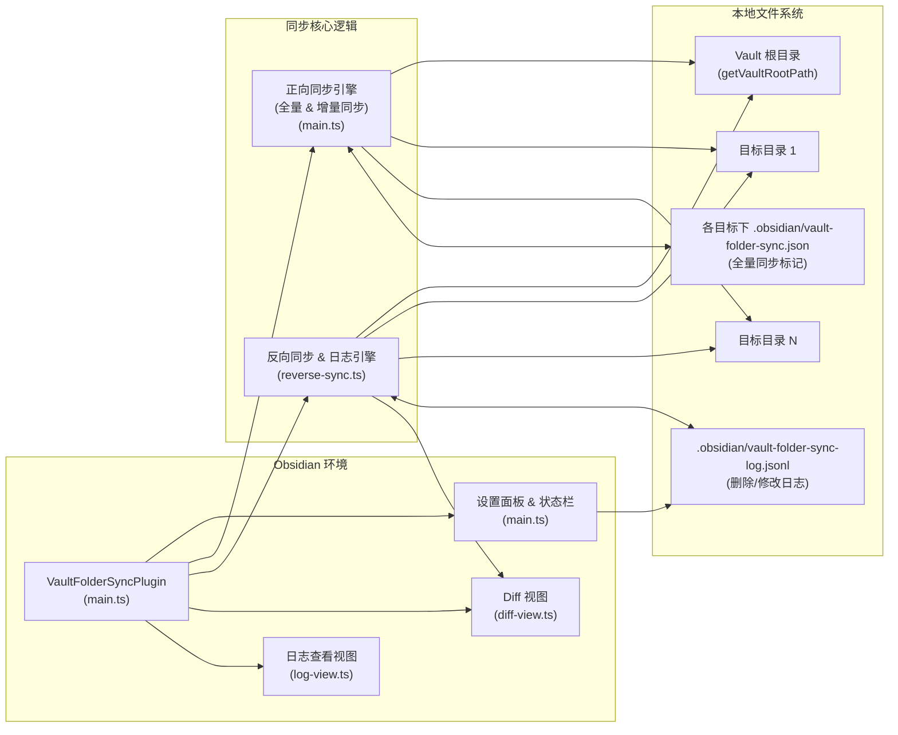

## 系统架构设计（Vault Folder Sync）

### 一、整体架构概览

Vault Folder Sync 是一个 **Obsidian 桌面端插件**，通过监听 vault 内文件事件与定时任务，将当前 vault 的内容同步到一个或多个外部目录，并可选支持反向同步与冲突查看。

- **运行环境层**：Obsidian 桌面应用（提供 `Plugin`、`App`、`Vault`、`FileSystemAdapter` 等接口）。
- **插件核心层（`main.ts`）**：插件生命周期管理、配置管理、正向同步引擎、定时任务、状态栏状态展示。
- **反向同步与日志层（`reverse-sync.ts`）**：跨目录日志合并、反向同步逻辑、删除决策、冲突检测与触发 Diff 视图。
- **UI 扩展层（`diff-view.ts` / `log-view.ts`）**：冲突 Diff 视图、日志查看视图、设置面板 UI 组件。
- **外部资源层**：本地文件系统中的 vault 根目录与多个目标目录（外部同步目录）。

### 二、逻辑组件视图

使用组件视图描述主要模块及其关系（采用 Mermaid 语法，可在支持的 Markdown 渲染器中直接查看）：

### 三、模块职责划分

#### 1. 插件核心模块：`main.ts`

- **插件生命周期管理**
  - `VaultFolderSyncPlugin` 继承自 Obsidian `Plugin`：
    - `onload()`：加载配置、注册视图、初始化状态栏、注册 vault 事件与命令、启动定时同步任务、启动时执行一轮“日志合并 → 正/反向同步 → mtime 校验”。
    - `onunload()`：在插件卸载/关闭前尝试执行一次快速同步。
- **配置与状态管理**
  - `VaultFolderSyncSettings`、`SyncTarget`：维护多个目标目录的配置（路径、启用状态、是否启用反向同步、首轮全量同步标记等）。
  - `loadSettings()` / `saveSettings()`：持久化设置。
  - `VaultFolderSyncSettingTab`：在 Obsidian 设置面板中提供：
    - 同步间隔设置。
    - 目标目录列表的增删改；为每个目标配置正向/反向同步开关及路径。
    - 内嵌 `createLogView()`，用于查看 JSONL 日志文件。
- **Vault 事件监听与变更队列**
  - 使用 `this.app.vault.on("create" | "modify" | "delete" | "rename")` 监听文件事件。
  - 将事件归一化后写入：
    - `changedFiles: Map<string, ChangeType>`：记录增删改。
    - `pendingRenames: RenameChange[]`：记录重命名（先 rename、再处理内容同步）。
  - 在本地源侧变更时调用 `logLocalSourceChange(app, relPath, kind)`，将修改/删除写入 JSONL 日志，供反向同步与冲突判断使用。
- **正向同步引擎**
  - **调度入口**：
    - `runPeriodicSync()`：定时任务入口（先调用 `mergeLogsForTargets` 合并日志，再触发 `triggerSync(false)` 与 `runReverseSyncOnce`）。
    - `triggerSync(forceFull, manual)`：根据配置与标记文件，在各目标上执行全量或增量同步。
  - **全量同步**：`fullSyncTarget(sourceRoot, target)`
    - 从 vault 根目录递归复制到目标目录（包含 `.obsidian` 与附件）。
    - 删除目标目录中多余的文件/目录，保证结构完全一致。
    - 在目标 `.obsidian` 写入 `vault-folder-sync.json` 标记，表示已经完成过一次全量同步。
  - **增量同步**：`incrementalSyncTarget(sourceRoot, target)`
    - 先应用 `pendingRenames`（在目标目录执行重命名操作）。
    - 遍历 `changedFiles`：
      - `deleted`：删除目标中的对应文件/目录。
      - `created`/`modified`：按需创建目录并复制文件（保持 mtime 等元数据）。
    - 完成后清空 `changedFiles` 与 `pendingRenames`。
- **一致性校验（基于 mtime）**
  - `verifyTargetsByMtime(sourceRoot, targets)`：
    - 仅针对已经做过全量同步的目标目录。
    - 逐目标调用 `verifyDirectoryByMtime(sourceDir, targetDir)`：
      - 第一遍：遍历源目录，根据 mtime 判断是否需要重新复制到目标。
      - 第二遍：遍历目标目录，删除源中已不存在的文件/目录（排除自身的标记文件）。
- **状态栏 UI**
  - `setStatusPending()` / `setStatusSyncing()` / `setStatusSynced()`：
    - 在 Obsidian 状态栏展示当前同步状态（待同步 / 同步中 / 已同步），并设置 tooltip 说明。

#### 2. 反向同步与日志模块：`reverse-sync.ts`

- **日志模型**
  - 使用 `.obsidian/vault-folder-sync-log.jsonl` 作为 JSON Lines 日志文件：
    - 记录源、目标两侧的“修改”与“删除”事件（包含 `relPath`、时间戳、事件类型、来源 side、是否已合并/已解决等）。
  - `RawLogEntry`、`DeletionLog` 等模型与辅助函数：
    - `loadDeletionLog()`：读取/聚合删除日志（忽略已 resolved、过滤无效行）。
    - `mergeRawEntries()` / `mergeLogsBetween()` / `mergeLogsForTargets()`：在源与各目标之间合并日志，去重、按时间排序，并设置 `merged` 标记。
- **反向同步主流程**
  - `runReverseSyncForTargets(app, sourceRoot, targetRoots)`：
    - 读取当前 JSONL 日志到内存（`currentRawLogEntries`）。
       - 对每个目标调用 `syncOneTarget()`。
  - `syncOneTarget(app, sourceRoot, targetRoot, log, logPath)`：
    - **第一步：遍历目标目录 → 写回源目录**（`traverseTargetAndSync`）：
      - 处理新增文件（目标有、源无）：直接从目标复制到源，并写入“目标修改”日志。
      - 处理 mtime 差异：
        - 仅目标侧有变更：目标较新时覆盖源。
        - 两侧都有未解决变更：判定为冲突，通过 `openDiffForConflict` 打开 Diff 视图，提示用户处理。
    - **第二步：遍历源目录 → 处理目标已删除的情况**（`handleDeletions` / `handleSingleDeletion`）：
      - 引入“删除日志 + 两次判定”的策略：
        - 第一次发现“目标已删除，源仍存在”时，只记录删除时间；
        - 再次检测且删除时间晚于源的最后修改时间时，才真正删除源侧文件。
      - 如果结合日志判断两侧均有未解决事件，则视为 **删除冲突**，并通过 Diff 视图展示“当前源文件 vs 空文件”的差异。
- **与 Diff 视图的集成**
  - 通过 `openDiffForConflict(app, relPath, sourcePath, targetPath)`：
    - 读取源/目标内容，使用 `diff` 库生成文本 diff。
    - 更新全局 `conflictEntries`，并在右侧面板中展示单一 Diff 视图，支持上下切换多个冲突。
  - 通过 `markConflictResolved(app, relPath)`：
    - 将对应日志条目标记为 `resolved: true`，避免后续重复提示。

#### 3. Diff 视图模块：`diff-view.ts`

- 定义视图类型 `DIFF_VIEW_TYPE = "vault-folder-sync-diff-view"` 与 `VaultFolderSyncDiffView`（继承自 `ItemView`）。
- 通过 `registerDiffView(plugin)` 将视图注册到 Obsidian：
  - 视图展示当前所有冲突文件的文本 diff。
  - 支持在多个冲突之间切换（上一条 / 下一条）。
  - 提供“已解决冲突”按钮，将对应日志记录标记为 resolved，并从当前列表中移除。
- 使用 Obsidian `WorkspaceLeaf` API 确保任意时刻只存在一个 Diff 视图 tab，避免 UI 混乱。

#### 4. 日志查看模块：`log-view.ts`

- `createLogView(containerEl, app)`：
  - 在插件设置页中添加“日志查看”小节。
  - 提供“加载日志”按钮：
    - 通过 `FileSystemAdapter` 获取 vault 根路径。
    - 读取 `.obsidian/vault-folder-sync-log.jsonl`，并在 UI 中以原始文本形式展示（便于开发者或高级用户排查问题）。
  - 提供清晰的错误/环境提示（如非桌面版不支持读取本地 FS）。

### 四、数据流与时序简述

#### 1. 正向同步数据流

1. 用户在 Obsidian 中创建/修改/删除/重命名文件。
2. `main.ts` 监听到事件，更新 `changedFiles` / `pendingRenames` 队列，并调用 `logLocalSourceChange` 记录源侧变更。
3. 周期任务或手动命令触发 `triggerSync(false)`：
   - 根据标记文件决定每个目标是否需要全量同步。
   - 对已完成全量的目标，仅对 `changedFiles` 中的项目执行增量同步。
4. 正向同步完成后，状态栏更新为“已同步”，并在启动阶段额外通过 mtime 校验修正潜在遗漏。

#### 2. 反向同步与删除决策数据流

1. 用户在目标目录中直接编辑/新增/删除文件（Obsidian 外部操作）。
2. 周期任务中的 `runReverseSyncOnce(sourceRoot)` 调用 `runReverseSyncForTargets`：
   - 先通过 `mergeLogsForTargets` 合并源/目标两侧的 JSONL 日志。
   - 对每个目标执行：
     - 遍历目标目录，将“目标更新/新增”的文件写回源侧（必要时产生日志和 Diff 冲突查看）。
     - 遍历源目录，结合“删除日志 + 源文件 mtime”，决定是否真正删除源侧文件或提示删除冲突。
3. 日志文件 `.obsidian/vault-folder-sync-log.jsonl` 按行追加、周期性合并，并对已合并且过期的条目进行 TTL 过滤，避免无限膨胀。

### 五、构建与部署视角（简要）

虽然不属于运行时架构，但项目通过以下方式统一构建与部署：

- **打包与依赖管理**
  - `package.json` 指定：
    - 使用 `esbuild` 将 `main.ts` 打包为 `main.js`（CJS，`obsidian` 外部依赖）。
    - 开发时通过 `npm run dev` 进行 watch 构建。
  - `main.js` 与 `manifest.json` 作为 Obsidian 插件入口。
- **构建脚本**
  - `build-vault-folder-sync.sh` / `build-vault-folder-sync.bat`：
    - 自动安装依赖、运行打包。
    - 支持将构建产物一键部署到一个或多个 vault 的插件目录。

### 六、小结

整体上，Vault Folder Sync 采用 **“核心插件 + 同步引擎 + 日志/冲突子系统 + UI 视图”** 的分层架构：

- 核心插件模块负责生命周期、配置、调度与状态展示。
- 正向同步与反向同步通过本地文件系统和 JSONL 日志实现双向增量同步与删除决策。
- Diff 视图与日志查看模块分别承载冲突可视化与运维排查能力，使同步行为对用户更透明、可控。

